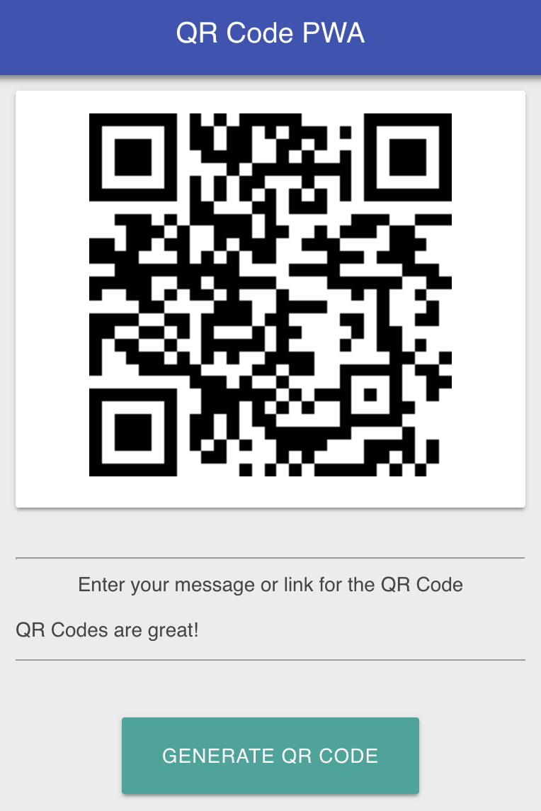

# QR Code Progressive Web App

Built to learn how to make Progressive Web Apps, this displays a QR Code containing a message. 

See it online at: [qr-code-pwa.firebaseapp.com/](https://qr-code-pwa.firebaseapp.com/)

## Resources

The resources used to create this app:

- [Your First Progressive Web App - Google Developers](https://developers.google.com/web/fundamentals/codelabs/your-first-pwapp/)
- [jeromeetienne/jquery-qrcode: qrcode generation standalone (doesn't depend on external services)](https://github.com/jeromeetienne/jquery-qrcode)

## Licence

MIT Licence
